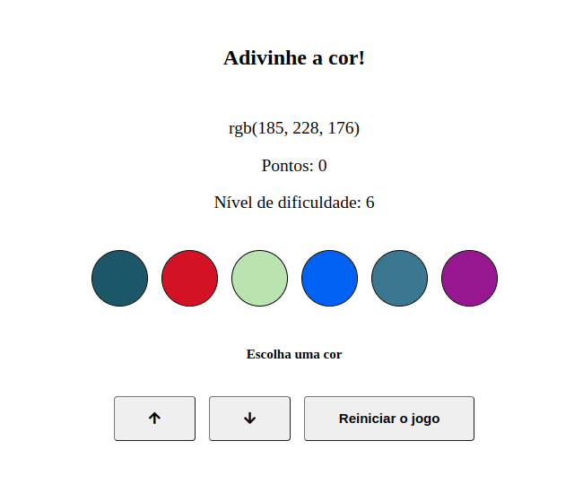

# About the project / *Sobre o projeto*

This project is an application to guess the color from an RBG value. The user will be able to increase the difficulty of the game by adding more color elements. The game basically works by Javascript and DOM manipulation.

*Esse projeto é uma aplicação para adivinhar a cor a partir de um valor RBG. O usuário poderá aumentar a dificuldade do jogo, adicionando mais elementos de cor. O jogo funciona basicamente por Javascript e manipulação do DOM.*

---
# Skills / *Habilidades*

 - HTML
 - CSS
 - Javascript
 - DOM manipulation / *Manipulação DOM*

---
# Layout

---
# Deployment / *Implantação*

See it in action/ **Veja em ação**: [https://kelsonbatista.github.io/project-color-guess/](https://kelsonbatista.github.io/project-color-guess/)
